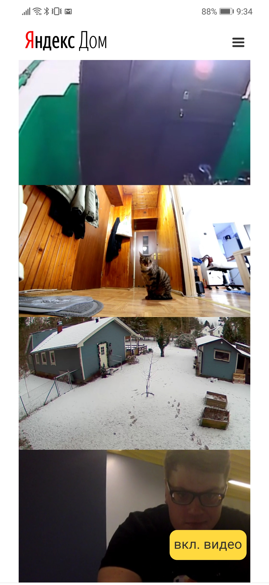

# Домашняя работа по мультимедиа
## **Запуск**
### Запуск front-end
1. Клонировать репозиторий

```
git clone https://github.com/MoonW1nd/crispy-engine.git
```

2. Переключится на ветку multimedia-homework

```
git checkout multimedia-homework
```

3. Установить зависимости

```
npm install
```

4. Запуск dev-сервера
```
npm start
```

Сайт должен открыться на 8000 порту: http://localhost:3000/

> ! Для тестирования на мобильной версии через WI-FI необходимо вручную прописать IP роутера в файле `src/pages/cctv/main.cctv.js` в переменную `localIP` [пример](https://github.com/MoonW1nd/crispy-engine/blob/4b922dd0de3360214e641b0523386b6be119d936/src/pages/cctv/main.cctv.js#L11)

### Запуск сервера раздачи видео потока
1. Клонировать репозиторий

```
git clone https://github.com/mad-gooze/shri-2018-2-multimedia-homework.git
```

2. Установить зависимости

```
npm install
```

3. Запуск dev-сервера
```
npm start
```

## **Файловая структура:**

```
  src/
  |__ assets/        //папка с изображениями
  |    ...
  |
  |__ blocks/        //папка с основными блоками
  |    ...
  |
  |__ data/          // все нужные данные
  |   ...
  |
  |__ content/       // файл с разметкой, скриптами и стилями для контента страницы
  |   ...
  |
  |__ pages/        // папка в которой содержатся точки дочерних страниц
  |   ...
  |
  |__ index.html     // точки входа для главной страницы
  |__ main.js
  |__ main.scss
  |__ common.scss    // общие стили для всех страниц
  ...
```

## **Выполненные задания**
Видео рисуются на `canvas` для реализации наложения фильтров. Использовал canvas так как у него поддержка лучше, чем через CSS Filters, к тому же можно более гибко управлять накладываемыми эффектами.

**Страница-вкладка в интерфейсе умного дома "Видеонаблюдение":**
  - [x] На странице должна находиться сетка из 4-ёх видео-превью. Клик по превью разворачивает соответствующее видео на всю страницу.
    > Сверстал с помощью grid layout, все  ячейки имею определенный пропорции и видео растягиваются на всю ширину ячейки.
  - [x] Анимацию разворачивания видео можно сделать по аналогии с маковским приложением Photo Booth.
    > Анимация реализована с помощью безопасных свойств transform: scale() и translate(). При старте на превью видео отображается в 360p, при развороте на полный экран размер и качество видео подстраивается.
  - [x] Когда видео раскрыто на всю страницу, в интерфейсе нужно предусмотреть кнопку "Все камеры", которая позволяет вернуться назад.
  - [x] Анимация переключения видео должна работать без тормозов (без просадки FPS на странице)

**Фильтры для видео:**
  > Реализация фильтров лежит в `src/blocks/VideoPlayer/filters`.
  - [x] Видео-поток с камеры может быть плохого качества (размытый, засвеченный или затемненный) - добавьте на экран просмотра видео возможность регулировать его яркость и контрастность.
  - [x] Для контролов настройки яркости/контрастности можете реиспользовать слайдеры из вашего вступительного задания, либо просто используйте input (реализация контрола не будет оцениваться дополнительно).

**Анализатор звука:**
  > Реализация фильтров лежит в `src/blocks/AudioAnalyser.
  - [x] Реализуйте анализатор громкости звука в потоке из открытой камеры (в виде столбчатой диаграммы).

**Дополнительно**
 - Работу на мобильных тестировал на Android 8.1
 - добавил обработку критических ошибок: [gitHub](https://github.com/MoonW1nd/crispy-engine/blob/4b922dd0de3360214e641b0523386b6be119d936/src/blocks/VideoPlayer/VideoPlayer.js#L279-L297)
 - При смене качества иногда потоки начинают глючить, это происходит не всегда но достаточно часто, при этом кидаются в консоль ошибки, пытался изменять параметры hls - не помогло.
 - На некоторых устройствах блокируется автовоспроизведение видео, для решения данной проблемы, если видео не запустилось появляется кнопка "вкл. видео" которая запускает проигрывание видео:

 
